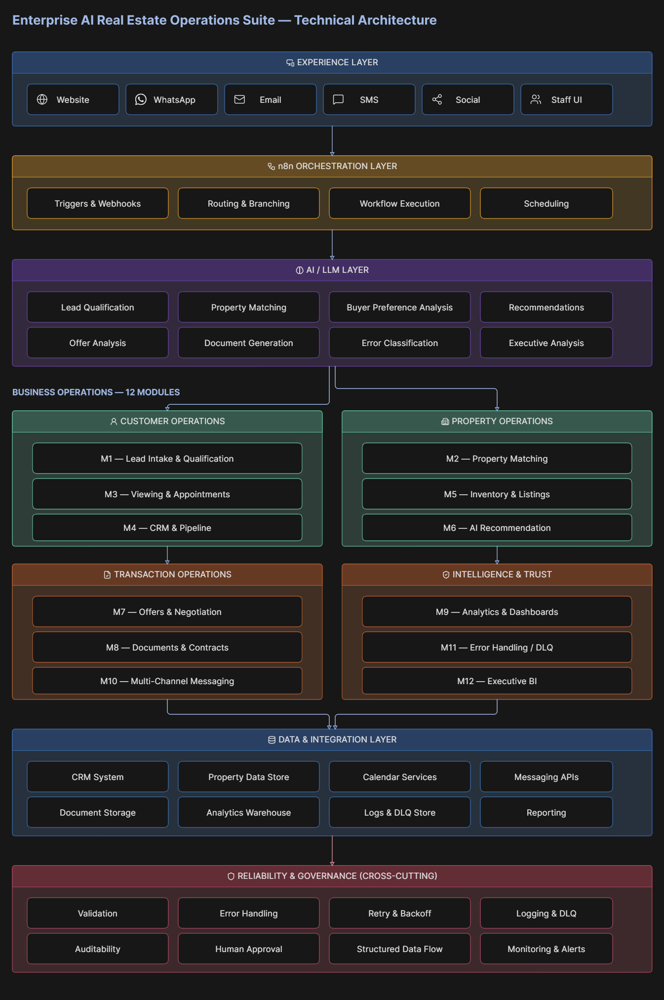
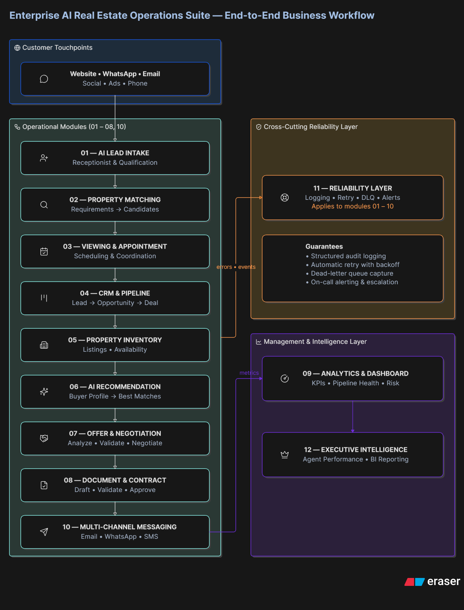

<div align="center">

# 🏢 Enterprise AI Real Estate Operations Suite

### Enterprise AI Automation Platform for Modern Real Estate Businesses

<p>
An intelligent, modular automation system designed to streamline the complete
real estate operational journey — from lead acquisition and property matching
to offers, contracts, communication, analytics, and executive intelligence.
</p>

<br>


<br><br>

<table>
<tr>
<td align="center"><b>n8n</b></td>
<td align="center"><b>AI / LLM</b></td>
<td align="center"><b>AI Agents</b></td>
<td align="center"><b>APIs</b></td>
<td align="center"><b>CRM</b></td>
<td align="center"><b>Webhooks</b></td>
</tr>
<tr>
<td align="center">Automation</td>
<td align="center">Intelligence</td>
<td align="center">Decision Support</td>
<td align="center">Integrations</td>
<td align="center">Operations</td>
<td align="center">Connectivity</td>
</tr>
</table>

<br>


</div>

---

# 🎯 Overview

Real estate operations are rarely limited by a lack of software.

The bigger challenge is **fragmentation**.

Leads arrive through different channels.  
Property information changes continuously.  
Agents manage multiple conversations.  
Appointments require coordination.  
Offers and documents move between people and systems.  
Follow-ups can be missed.  
Management often lacks a unified operational view.

The **Enterprise AI Real Estate Operations Suite** is designed to address this fragmentation through a connected, modular automation architecture.

Instead of building isolated automations for individual tasks, this system connects the major operational stages of a real estate business into one intelligent framework.

### The operating journey

<div align="center">

**LEAD**

↓  

**QUALIFICATION**

↓  

**PROPERTY MATCHING**

↓  

**VIEWING**

↓  

**CRM**

↓  

**AI RECOMMENDATION**

↓  

**OFFER & NEGOTIATION**

↓  

**DOCUMENTS**

↓  

**COMMUNICATION**

↓  

**ANALYTICS**

↓  

**EXECUTIVE INTELLIGENCE**

</div>

---

# 💼 Business Objective

The objective is straightforward:

### **Reduce repetitive operational work while improving speed, consistency, visibility, and decision-making across the real estate business.**

The platform is designed to help real estate organizations:

<table>
<tr>
<td width="50%">

### Lead Operations

- Capture incoming leads
- Classify lead intent
- Extract buyer requirements
- Qualify prospects
- Prioritize opportunities
- Maintain structured pipelines

</td>

<td width="50%">

### Property Operations

- Manage property inventory
- Structure listing information
- Match buyers with properties
- Generate AI-assisted recommendations
- Track property availability
- Support property viewing workflows

</td>
</tr>

<tr>
<td width="50%">

### Transaction Operations

- Process offers
- Structure negotiation data
- Automate document workflows
- Track transaction stages
- Coordinate approvals
- Maintain operational consistency

</td>

<td width="50%">

### Business Intelligence

- Monitor operational KPIs
- Track agent performance
- Detect workflow failures
- Analyze business activity
- Generate executive insights
- Support data-driven decisions

</td>
</tr>
</table>

---

# 🧠 The Core Idea

This project is built around one principle:

<div align="center">

## **Don't automate a task.**
## **Build the system around the business.**

</div>

The architecture combines:

**AI + Automation + Structured Data + APIs + Business Logic + Human Oversight**

into a unified operational framework.

AI is used where intelligence adds value.

Automation is used where repetitive execution can be removed.

Human oversight remains available where business judgment matters.

This creates a practical approach to AI automation rather than a collection of disconnected demonstrations.

---

# 🏗️ Enterprise Architecture

The platform follows a modular architecture in which each major business responsibility is represented by an independent workflow module.

### High-Level Architecture

```text
┌──────────────────────────────────────────────────────────────┐
│                     CLIENT CHANNELS                          │
│                                                              │
│  Website  •  Email  •  WhatsApp  •  Forms  •  Internal Team │
└──────────────────────────────┬───────────────────────────────┘
                               │
                               ▼
┌──────────────────────────────────────────────────────────────┐
│                  AUTOMATION ORCHESTRATION                     │
│                                                              │
│                           n8n                                │
│              Workflow Routing • Logic • Execution             │
└──────────────────────────────┬───────────────────────────────┘
                               │
                               ▼
┌──────────────────────────────────────────────────────────────┐
│                     AI INTELLIGENCE LAYER                    │
│                                                              │
│  Classification • Extraction • Matching • Recommendation     │
│  Analysis • Decision Support • Structured AI Processing      │
└──────────────────────────────┬───────────────────────────────┘
                               │
                               ▼
┌──────────────────────────────────────────────────────────────┐
│                  REAL ESTATE OPERATIONS                       │
│                                                              │
│ Lead → Property → Viewing → CRM → Offer → Documents          │
│                         ↓                                    │
│                 Communication → Analytics                    │
└──────────────────────────────┬───────────────────────────────┘
                               │
                               ▼
┌──────────────────────────────────────────────────────────────┐
│                  DATA & INTEGRATION LAYER                     │
│                                                              │
│       CRM • Calendar • Messaging • Storage • APIs            │
└──────────────────────────────┬───────────────────────────────┘
                               │
                               ▼
┌──────────────────────────────────────────────────────────────┐
│              RELIABILITY & BUSINESS INTELLIGENCE              │
│                                                              │
│ Logging • Retry • DLQ • Analytics • Agent Metrics             │
│                 Executive Reporting                           │
└──────────────────────────────────────────────────────────────┘


📐 Technical Architecture

The architecture separates business logic into specialized modules while maintaining structured data flow between them.

This allows the system to remain:

Modular
Maintainable
Testable
Integration-ready
Extensible
Easier to debug
Easier to adapt to different real estate organizations
Architecture Diagram
<div align="center">  </div>
🔄 End-to-End Workflow

The complete workflow represents the operational lifecycle of a real estate prospect.

<div align="center">
Lead → Property → Viewing → CRM → Recommendation → Offer → Documents → Communication → Intelligence
</div>

The workflow is divided into specialized automation modules rather than one oversized workflow.

This approach allows each operational capability to be developed, tested, monitored, and improved independently.

Complete Workflow Diagram
<div align="center">  </div>
🧩 12-Module Enterprise Architecture

The system consists of 12 specialized modules, covering the complete operational lifecycle.

<table> <tr> <th>#</th> <th>Module</th> <th>Primary Responsibility</th> </tr> <tr> <td><b>01</b></td> <td><b>AI Lead Intake & Receptionist</b></td> <td>Capture, understand, classify, qualify, and route incoming prospects.</td> </tr> <tr> <td><b>02</b></td> <td><b>Smart Property Matching Engine</b></td> <td>Identify properties aligned with buyer requirements.</td> </tr> <tr> <td><b>03</b></td> <td><b>Property Viewing & Appointment Scheduling</b></td> <td>Coordinate property viewings and appointment workflows.</td> </tr> <tr> <td><b>04</b></td> <td><b>CRM & Lead Pipeline Management</b></td> <td>Maintain structured lead, opportunity, and pipeline data.</td> </tr> <tr> <td><b>05</b></td> <td><b>Property Listing & Inventory Management</b></td> <td>Manage listing information, property records, and inventory status.</td> </tr> <tr> <td><b>06</b></td> <td><b>Property Matching & AI Recommendation Engine</b></td> <td>Generate intelligent property recommendations based on prospect requirements.</td> </tr> <tr> <td><b>07</b></td> <td><b>Offer & Negotiation Management</b></td> <td>Structure offers, evaluate transaction information, and support negotiation workflows.</td> </tr> <tr> <td><b>08</b></td> <td><b>Document & Contract Automation</b></td> <td>Automate document processing, validation, routing, and transaction workflows.</td> </tr> <tr> <td><b>09</b></td> <td><b>Analytics & Business Dashboard</b></td> <td>Transform operational data into measurable business KPIs.</td> </tr> <tr> <td><b>10</b></td> <td><b>Multi-Channel Communication & Messaging</b></td> <td>Coordinate customer and internal communication across multiple channels.</td> </tr> <tr> <td><b>11</b></td> <td><b>Error Handling, Logging & Dead-Letter Queue</b></td> <td>Detect, log, retry, isolate, and manage failed automation executions.</td> </tr> <tr> <td><b>12</b></td> <td><b>Agent Performance & Executive Business Intelligence</b></td> <td>Provide operational performance metrics and executive-level business insights.</td> </tr> </table>
🤖 AI Intelligence Layer

AI is integrated into the architecture as a business intelligence layer, rather than being treated as a standalone feature.

AI capabilities include:
<div align="center">
Intelligence Area	Capabilities
Lead Intelligence	Intent detection, qualification, requirement extraction
Property Intelligence	Matching, ranking, recommendations
Transaction Intelligence	Offer analysis, structured negotiation support
Document Intelligence	Information extraction, validation, workflow routing
Operational Intelligence	Pattern detection, performance analysis
Executive Intelligence	KPI interpretation, reporting, decision support
</div>
👤 Human-in-the-Loop

Enterprise automation should not blindly automate every decision.

The system therefore supports a Human-in-the-Loop approach for business-critical operations.

Human review can be introduced where required for:

High-value offers
Negotiation decisions
Contract approval
Transaction exceptions
Sensitive customer situations
Failed automation recovery
Business-critical decisions

The purpose of AI is not to remove business judgment.

The purpose is to give people better information, faster execution, and more time to focus on high-value work.
⚙️ Workflow Design Philosophy

Every module follows a structured automation pattern.

<div align="center">
Trigger

↓

Data Normalization

↓

Business Logic

↓

AI Processing

↓

Validation

↓

Structured Output

↓

Next Business Process
</div>

This architecture makes individual workflows easier to test, maintain, debug, extend, and integrate with external systems.

🔌 Integration-Ready Architecture

The system is designed around an API / Webhook-ready integration model.

Potential production integrations include:

CRM

GoHighLevel • HubSpot • Salesforce

Communication

WhatsApp Cloud API • Email • SMS • Messaging APIs

Calendar

Google Calendar • Microsoft Outlook

Storage & Documents

Google Drive • SharePoint • Dropbox

AI

OpenAI • Anthropic • Other LLM Providers

The architecture keeps the core business workflows modular so external services can be connected without redesigning the entire system.

📊 Project Status
<div align="center">     </div> <br>
Capability	Status
12 Core Automation Modules	✅ Complete
AI / LLM Workflows	✅ Implemented
n8n Automation Architecture	✅ Implemented
Modular Workflow Design	✅ Implemented
API / Webhook Readiness	✅ Supported
Analytics & Dashboard Layer	✅ Implemented
Error Handling & Logging	✅ Implemented
Dead-Letter Queue	✅ Implemented
Agent Performance Tracking	✅ Implemented
Executive Business Intelligence	✅ Implemented
Workflow Testing	✅ Completed
<div align="center">
🏢 Enterprise AI Real Estate Operations Suite

12 Modules. One Connected Architecture.

Built to demonstrate how AI automation can become an operational layer for a real estate business.

</div> ```

